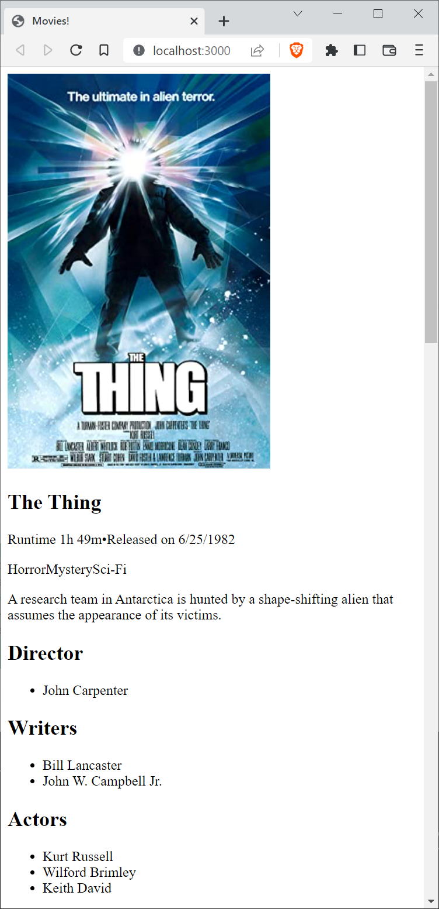

# Web Technologies - Exercise 1

The first exercise consists of three parts. One of them on the server-side, two on the client-side. You find detailed information about these three parts in the <code>Tasks</code> section.

Before you start, you will have to install the dependencies of the sceleton project. In the project's root directory (where this README file is located), run

    npm install

To run the server, you have two options. The first one is to run it using the start script. To do so, run

    npm start

The second, recommended option is to run the server using `nodemon` to monitor for changes in your code. When using `nodemon`, you do not have to restart your server when making changes. To run your server using `nodemon`, you can use the `start-nodemon` script by running

    npm run start-nodemon

Whichever option you choose, you should see the message

    Server now listening on http://localhost:3000/

in your terminal. Visit this URL to test the application. You will see a simple message from the server: `Hello world!`.

## Project structure

At the moment, the application consists of only one file on both sides. On the server-side, the file is `server/server.js`, on the client side, the file is `server/files/index.html`. 

First, have a look at `server.js`, maybe you can guess the responsibilities of the separate blocks. For now, there are only two blocks of code that you need to understand.

The first one is

```js
    app.get('/data', function (req, res) {
        res.send('!dlrow olleH')
    })
```

This blocks tells the server to send the string `!dlrow olleH` to the client making a `GET` request to the path `/data`. You can check that the server is doing that by accessing `http://localhost:3000/data`. You will see the original, reversed data that the server sends.


The second part of `server.js` you need to understand is

```js
    app.use(express.static(path.join(__dirname, 'files')));
```

This part tells the server to serve all files located in the `files` directory to a client requesting them. We are making use of so-called middleware to accomplish that. For now you do not need to understand how this works in detail, we are going to talk about middleware in future classes. The thing you need to understand is that this is the way how the `index.html` file located within the `files` directory on the server-side is being sent to the client.

Now, browse the application again by pointing a browser to `http://localhost:3000/` and open the page source. You will find the contents of `server/files/index.html`. 

If you look closely, you will find the lines

```js
    xhr.open("GET", "/data")
    xhr.send()
```

which are resonsible for asking the server for the data by making the `GET` request mentioned above. Again, you do not need to understand the details of you this works, the only interesting part for now is the the following line

```js
    bodyElement.append(reverseString(xhr.responseText))
```

That's were the magic is happening. The `responseText` property of the `xhr` variable contains the content that was sent by the server - the reversed message `!dlrow olleH`. The client uses the function `reverseString` (which you find a few lines above) to reverse the string and the `append` method of the html element of the body of the page to add the reversed message to the body. That's how the message from the server ends up on our web page, when we open the application.

## Tasks
As mentioned at the beginning, this exercise consists of three parts. 

1. First, who will have to change the data the the server returns, e.g. you will have to replace the `!dlrow olleH` with JSON content about movies. This is done on the server side in `server/server.js`.
1. The second part is already located on the client side in `server/files/index.html`. You will parse the JSON data that the client sends and build HTML elements in the DOM to render that data.
1. Finally, the third part also needs to be implemented on the client side. In this part you will style the data that you rendered in part 2 to look a bit prettier.

### Checking your implementation
To check whether your implementation is working as expected you can use Cypress end-to-end tests. To start the tests, run

    npm run cypress

If you do so within making any changes to the application, all tests will fail. After implementing all the parts, all tests should pass. Here's how the Cypress UI looks after running the command above:


Choose `E2E Testing`, now you will be able to choose a browser to run the tests:


Apart from the browser found on your system, the Electron Browser is also available. This browser cames baked into Cypress and does not need to be installed separately.

**Warning!** Firefox has bugs when it comes to testing style related tests, so it's best to avoid testing using Firefox.

After you choose a browser and click the `Start E2E Testing in ...` button, the Cypress Tests are started using that browser. In Chrome this looks like this:

 screen opened in Chrome")

At the moment there is only one test specification (spec) file, namely `cypress/e2e/assessment.cy.js`. Click the file name to run the tests:


As expected, the tests fail! If necessary, you can run them manually by clicking on the `Reload icon` in the upper right corner or by hitting the `r` key.

### Part 1: Returning the book data from the /data endpoint

In this first part of the assignment, you have to structure book data in JSON. Choose three books of your liking and find the following pieces of information:

1. Title
1. ISBN, 10-digits
1. Price consisting of the value and the currency

On the server-side, format the information about the three books you chose in a way that:

1. The three books are represented as objects in an array
1. Each book has three properties: title, isbn, and price
2. The price property contains a nested object. This price object has two properties: value and currency.

### Part 2: Rendering the book data on the client side

In this part you will have to dynamically add new HTML elements to the `body` of the application`s HTML page. Before you can use the information, you will have to parse the JSON data into a JavaScript object. Then, loop through the three books contained in the object and

1. Add an `article` element for each book. The `article` element will contain three child elements
    1. An `h1` element containing the book's title as text
    1. Two `p` elements, one for the ISBN and one for the price information
1. Both `p` elements contain one child and one text node
    1. A `span` for the label of the information, e.g. 'ISBN' and 'Price'
    1. The text node contains the information
1. Render the price using two decimals, e.g. render `8.1` as `8.10` and concatenate the currency

Here's a screenshot of what your application will (appoximately) look like after implementing this part:



### Part 3: Styling the page

In this final part you will add some styling by applying CSS selectors and CSS properties. First off, you will need to add a `style` element to the `head` of the page. The styling consists of three CSS rules, one for the `body` element, one for the `article` elements and one for the `span` elements. 

You will need to add the following properties to the respective rules:

1. body
    1. A `font-family` with the two following fonts: `'Lucida Sans'` and `sans-serif`
1. article
    1. A solid `border-style`
    1. A `border-radius` of 12 pixels
    1. A `padding` of 4 pixels
    1. A 4 pixel `margin`
1. span
    1. A 4 pixel `margin`, but only on the `right`
    1. A bold `font-weight`

In the end, your application looks something like this:

