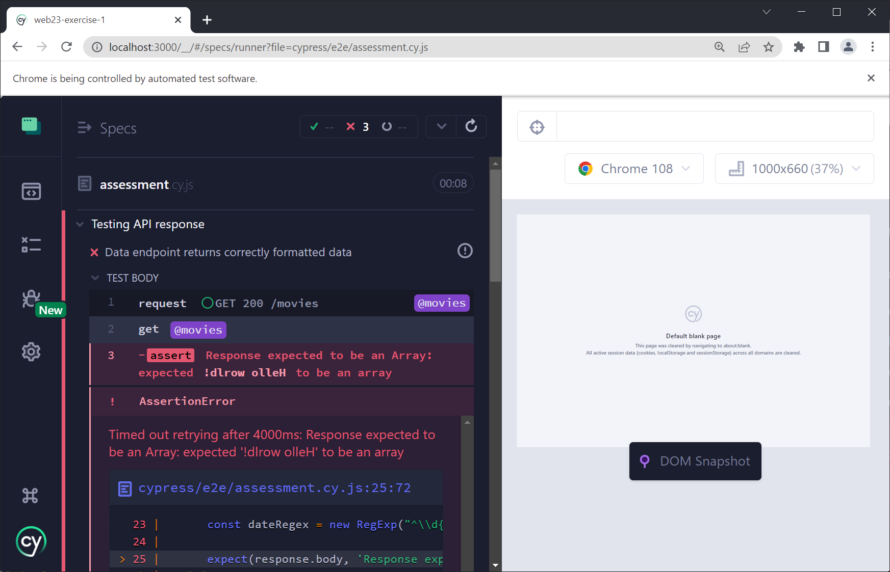
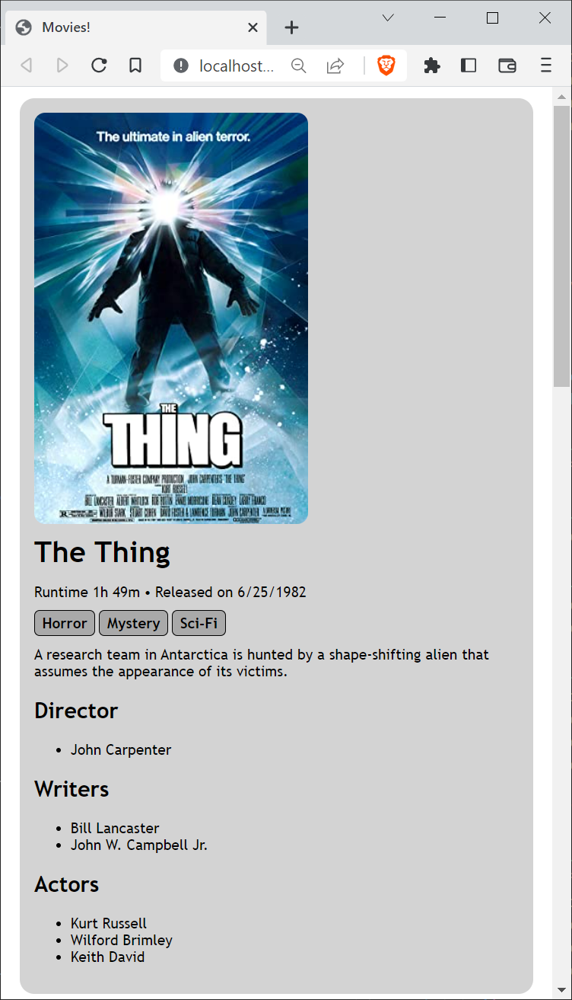

# Web Technologies - Exercise 1

This first exercise in Web Technologies consists of three parts. You will implement the first one on the server-side and the other two on the client-side. You find detailed information about these parts in the **Tasks** section below.

Before you start, you will have to set up the development environment. First and foremost, install [**Node.js**](https://nodejs.org/en/). Then, clone the repository that GitHub Classroom generated for you. Since you read this, this is most likely where you are now :).

Now configure an IDE, we recommand using [**WebStorm**](https://www.jetbrains.com/webstorm/) or [**Visual Studio Code**](https://code.visualstudio.com/). Finally, you need to install the dependencies of this project. In the project's root directory (where this <span style="font-family:Lucida Sans Typewriter">README</span> file is located), run

    npm install

The project consists of a server, which is implemented using **Node.js** and a client, which will be your favorite web browser.

To be able to access the application using a browser, you will have to start the server. To do so, you have two options. The first one is to run it using the start script:

    npm start

When using the start script, remember that you need to *restart the server whenever you make changes* to your project!

To avoid restarting the server manually each time after making a change, there is a second, **recommended** option. This option is to start the server using [`nodemon`](https://www.npmjs.com/package/nodemon). `nodemon` will not only start your server, but also monitor your code for changes you make. As a consequence, when using `nodemon`, you do not have to restart your server when making changes, which is quite helpful during development.

There is no need to install `nodemon` explicitely, it is already a development dependency of the project you cloned.

To run your server using `nodemon`, you can use the `start-nodemon` script by running

    npm run start-nodemon

Whichever option you choose, after starting the server you should see the message

    Server now listening on http://localhost:3000/

in your terminal. Visit [http://localhost:3000/](http://localhost:3000/) using your favorite Web Browser to test the application. You will see a simple message from the server displayed on the page:

    Hello world!

## Project structure

For the time being, the application consists of only one file on both sides. On the server-side, the file is `server/server.js`, on the client side, the file is `server/files/index.html`. 

First, have a look at `server/server.js`, maybe you can guess the responsibilities of the individual blocks of code. For now, there are two blocks that are of interest to you when implementing this exercise.

The first one is:

```js
    app.get('/movies', function (req, res) {
        res.send('!dlrow olleH')
    })
```

This blocks tells the server to send the string `!dlrow olleH` to a client making a `GET` request to the path `/movies`. You can check that the server is doing that by accessing [http://localhost:3000/movies](http://localhost:3000/movies). You will see the original, reversed data that the server sends. 

The second part of `server.js` of interest to you is

```js
    app.use(express.static(path.join(__dirname, 'files')));
```

This part tells the server to serve all files located in the `files` directory to a client requesting them. We are making use of so-called middleware to accomplish that. For now you do not need to understand how this works in detail, we are going to talk about middleware in future classes. The thing you need to understand is this is how we configure that the `index.html` file located in the `files` directory on the server-side is being sent to a client upon request.

Now, browse the application again by pointing a browser to [http://localhost:3000/](http://localhost:3000/) and **open the page source**. You will find the contents of `server/files/index.html`. Our middleware is working.

If you look closely near the end of the `index.html`, you will find the lines

```js
    xhr.open("GET", "/movies")
    xhr.send()
```

which are requesting the movie data from the server by making the `GET` request mentioned above. Again, you do not need to understand the details of how this works on the client-side, the only interesting part is the following line

```js
    bodyElement.append(reverseString(xhr.responseText))
```

That's were the data received from the server is added to the page. The `responseText` property of the `xhr` variable contains the content that was sent by the server - the reversed message `!dlrow olleH`. The client then uses the function `reverseString` (which you find a few lines above) to reverse the string and the `append` method of the html element of the body of the page to add the reversed message to the body. That's how the message from the server ends up on our web page when we open the application.

## Tasks
As mentioned at the beginning, this exercise consists of three parts.

1. First, who will have to change the data the server returns, e.g. you will have to replace `!dlrow olleH` with movie data formatted in JSON. This is done on the server side in `server/server.js`.
1. The second part is already located on the client side in `server/files/index.html`. Remember: Although this file resides on the server, it is requested by the client and parsed, displayed and executed on the client-side. Here you will add code to receive and parse the JSON movie data that the server sends and create and add HTML elements to the DOM to render that data.
1. In the third part you will make the page look somewhat prettier by adding some style. Styling using CSS is also implemented on the client side.

### Checking your implementation
To check whether your implementation is working as expected you **should** use Cypress end-to-end tests. These tests are the exact same tests used to assess your implementation once you commit it to the GitHub repository. 

To start the tests, run

    npm run cypress

If you do so without making any changes to the application, all tests will fail. After implementing an individual part, the corresponding test will pass. It is best to do them in order, because they build on top of each other. 

Here's how the Cypress UI looks after running the command above:


Choose `E2E Testing`, now you will be able to choose a browser to run the tests:


Apart from the browsers found on your system, the Electron Browser is also available. This browser cames baked into Cypress and does not need to be installed separately. Just in case you wonder where this one comes from ;).

**Warning!** Firefox has bugs when it comes to testing style related tests, so it's best to avoid testing using Firefox. We recommend to use **Chrome** because that's the one we will use during  assessment.

After you choose a browser and click the `Start E2E Testing in ...` button, the Cypress Tests are started using that browser. In Chrome this looks like this (altough your process name will be different):

 screen opened in Chrome")

At the moment there is only one test specification (spec) file, namely `cypress/e2e/assessment.cy.js`. Click the file name to run the tests:



As expected, **all** tests fail! By the way, this is what [Test-driven development](https://en.wikipedia.org/wiki/Test-driven_development) is all about :). 

If necessary, you can run them manually by clicking on the `Reload icon` in the upper right corner or by hitting the `r` key.

### Part 1: Returning the movie data from the /movies endpoint

In this first part of the assignment, you have to structure movie data in JSON. Choose **at least three movies** of your liking and use the **Examples** section of the [OMDb API](https://www.omdbapi.com/) to retrieve the data for these movies in JSON format.

For example, this is the data returned when searching for *The Thing*:

```json
{"Title":"The Thing","Year":"1982","Rated":"R","Released":"25 Jun 1982","Runtime":"109 min","Genre":"Horror, Mystery, Sci-Fi","Director":"John Carpenter","Writer":"Bill Lancaster, John W. Campbell Jr.","Actors":"Kurt Russell, Wilford Brimley, Keith David","Plot":"A research team in Antarctica is hunted by a shape-shifting alien that assumes the appearance of its victims.","Language":"English, Norwegian","Country":"United States, Canada","Awards":"3 nominations","Poster":"https://m.media-amazon.com/images/M/MV5BNGViZWZmM2EtNGYzZi00ZDAyLTk3ODMtNzIyZTBjN2Y1NmM1XkEyXkFqcGdeQXVyNTAyODkwOQ@@._V1_SX300.jpg","Ratings":[{"Source":"Internet Movie Database","Value":"8.2/10"},{"Source":"Rotten Tomatoes","Value":"84%"},{"Source":"Metacritic","Value":"57/100"}],"Metascore":"57","imdbRating":"8.2","imdbVotes":"430,351","imdbID":"tt0084787","Type":"movie","DVD":"14 Feb 2006","BoxOffice":"$19,629,760","Production":"N/A","Website":"N/A","Response":"True"}
```

Pick the following information from the data structure and delete the rest:

1. Title
1. Released
1. Runtime
1. Genre
1. Director
1. Writer
1. Actors
1. Plot
1. Poster
1. Metascore
1. imdbRating

You may have noticed that all properties have String values, even numerical data like *Metascore*. In the next step, do the following renaming and reformatting:

1. Rename *Genre*, *Director*, *Writer* to their plural forms to be consistent with *Actors*
1. Reformat *Released* to be in [ISO 8601](https://en.wikipedia.org/wiki/ISO_8601) format
1. Reformat *Runtime* to be an number (remove the unit **min** in the process)
1. Reformat *Genres* to be an array of genres and not a comma-separated string of genres
1. Do the same you did with *Genres* with *Directors*, *Writers*, and *Actors*, that is, convert them into an array of strings
1. Reformat *Metascore* to be a number
1. Reforamt *imdbRating* to be a number

Finally, put all the movies you chose in one JSON array and return that array instead of the `!dlrow olleH` string. To be precise, the array you return will contain three objects each of which represents the data of one movie.

**Once you have done that, the first test will pass! Make sure to check.** Since we did not change anything on the client side, the movie data you return will show up reversed on the web page.

### Part 2: Rendering the movie data on the client side

In this part you will have to dynamically add new HTML elements to the `body` of the application`s HTML page. Before you can use the information, you will have to find a way to parse the JSON data into a JavaScript array. Then, loop through the movies contained in the array and build the following HTML element structure for each movie:

* **article**. An article for the whole movie
    * **img**. An image showing the movie *Poster*
    * **h1**. A header with *Title* as content
    * **p** the paragraph for basic movie information
        * A **span** element containing the **Runtime**. Format the runtime in hours and minutes, e.g. *The Thing* has 109 minutes Runtime, which will be formatted as <span style="font-family:Lucida Sans Typewriter">1h 49m</span>. [Math.trunc(...)](https://developer.mozilla.org/en-US/docs/Web/JavaScript/Reference/Global_Objects/Math/trunc) might be helpful
        * A **span** containing a [bullet](https://en.wikipedia.org/wiki/Bullet_(typography)). See this [Stackoverflow question](https://stackoverflow.com/questions/13093126/insert-unicode-character-into-javascript) to see how to include a Unicode character in a JavaScript string
        * A **span** containing the *Released* date. Use [toLocaleDateString](https://developer.mozilla.org/en-US/docs/Web/JavaScript/Reference/Global_Objects/Date/toLocaleDateString) to format the ISO 8601 date string.

    * A paragraph **p** containing a **span** element for *each* genre of the movie. Assign the *class* **genre** to the element. For a movie with the genres Horror and Mystery this will look like this: ```<p><span class="genre">Horror</span><span class="genre">Mystery</span></p>```
    * Another paragraph **p** containing just the *Plot*
    * **h2**. A header saying 'Directors'
    * **ul**. An unordered list of all the directors of the movie, each director in its own **li** (list item)
    * **h2**. Another header for the 'Writers'
    * **ul**. Another unordered list with list items for each writer. E.g. for *The Thing*, the writers list will look like this: ```<ul><li>Bill Lancaster</li><li>John W. Campbell Jr.</li></ul>```
    * **h2**. A last header for the 'Actors'
    * **ul**. Again, an unordered list with all actors
       

Here's a screenshot of what your application will (appoximately) look like after implementing this part:


**Now the second test will pass :)**

### Part 3: Styling the page

In this final part you will add some styling by applying CSS selectors and properties. You will add CSS rules to the `style` element to the `head` of the page. The styling consists of six rules, five will apply to tag names (**body**, **h1**, ...), one will apply the **span** element with class *genre*.

Here are the details regarding the rules you must add:

1. **body**
    1. A `font-family` with the two following fonts: `'Trebuchet MS'` and `sans-serif`
1. **img**
    1. A `border-radius` of 2 to 32 pixels
1. **h1**
    1. A `font-size`: either **bold** or a weight between 100 to 400
    1. A short-hand `margin` consisting of two values
        * the first  value specifies the top and bottom margins and must be between 4 and 16
        * the second value specifies the left and right margin and must be between 0 and 8
1. **article**
    1. A `background-color` of your liking
    1. A `border-radius` between 2 and 32 pixels
    1. A `margin` between 2 and 16 of the viewport's width
    1. A `padding` between 2 and 32 pixels
1. **span**
    1. A **right** margin of more than 0 pixels
1. And finally, some styling for the genre tags, that is, the **span** elements that have class *genre*. Use a [class selector](https://developer.mozilla.org/en-US/docs/Web/CSS/Class_selectors)!
    1. A `background-color` of your liking
    1. A short-hand `padding` with two values (top-bottom and left-right), both between 2 and 16 pixels
    1. A `border-radius` between 2 and 32 pixels
    1. A `border` property containing a **width** between 1 and 8 pixels, a **style** and a **color** of your liking

In the end, your application looks something like this:



You have finished the first exercise: **Congratulations, all tests pass!** 